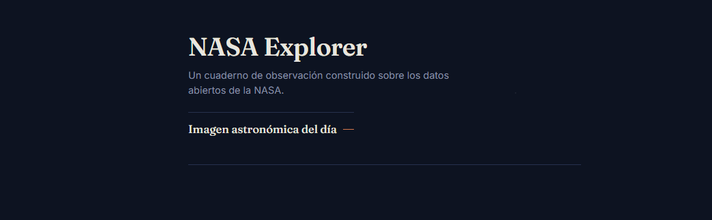
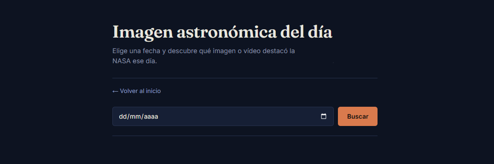
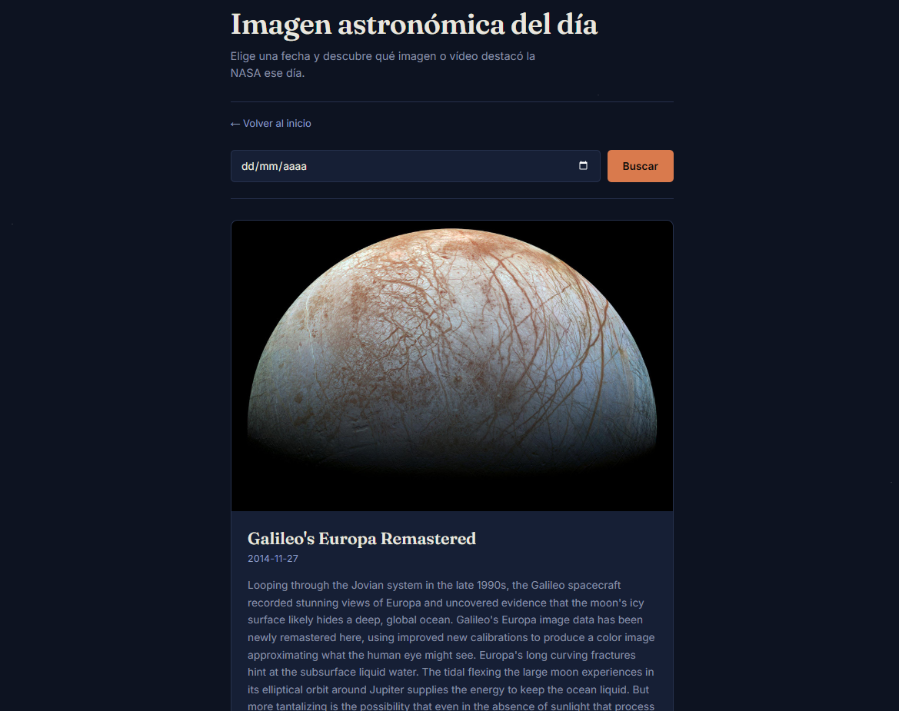

# NASA Explorer

Aplicación web en PHP que consume la API pública de la NASA para explorar datos e imágenes reales del espacio. Empieza por la Imagen Astronómica del Día (APOD), con más módulos en camino.

## Capturas

 

 



## Funcionalidades

- **Imagen Astronómica del Día (APOD)**: consulta la imagen o vídeo destacado por la NASA en cualquier fecha desde el 16 de junio de 1995 hasta hoy.
- Manejo de errores cuando la fecha no devuelve resultado.
- Soporte tanto para imágenes como para vídeos incrustados.

## Tecnologías

- PHP (sin frameworks, consumo directo de la API con `file_get_contents`)
- HTML / CSS
- [API de la NASA](https://api.nasa.gov/) (endpoint APOD)

## Cómo ejecutarlo en local

Este proyecto está pensado para correr sobre un entorno tipo XAMPP.

1. Clona el repositorio dentro de tu carpeta `htdocs`:
   ```bash
   git clone https://github.com/EffyCarsfleitz/NASA-explorer.git
   ```
2. Copia `config.example.php` y renómbralo a `config.php`.
3. (Opcional) Genera tu propia clave gratuita en [api.nasa.gov](https://api.nasa.gov/) y pégala dentro de `config.php`:
   ```php
   <?php
   define('NASA_API_KEY', 'TU_API_KEY_AQUI');
   ```
   Si no configuras `config.php`, el proyecto funciona igualmente usando la `DEMO_KEY` pública de la NASA, aunque con un límite de peticiones por hora más bajo (compartido con el resto de usuarios de internet que la usan sin key propia).
4. Inicia Apache desde el panel de XAMPP y abre el proyecto en el navegador:
   ```
   http://localhost/ProyectosPersonales/nasa-explorer/
   ```

## Estructura del proyecto

```
nasa-explorer/
├── index.php             # Página de inicio
├── apod.php               # Módulo de la Imagen Astronómica del Día
├── estilos.css             # Estilos generales
├── config.example.php      # Plantilla de configuración para clave API
├── config.php               # Mi propia clave (está en .gitignore)
└── .gitignore
```

## Roadmap

- [x] Módulo APOD (imagen del día)
- [ ] Galería de fotos del Mars Rover
- [ ] Rastreador de asteroides cercanos con gráficas (Chart.js)
- [ ] Sistema de favoritos con base de datos MySQL
- [ ] Caché de peticiones a la API

## Autora

Desarrollado por Elisabeth Carmona Balaguer

[GitHub](https://github.com/EffyCarsfleitz) · [LinkedIn](https://www.linkedin.com/in/elisabeth-carmona-balaguer-34306522a/)